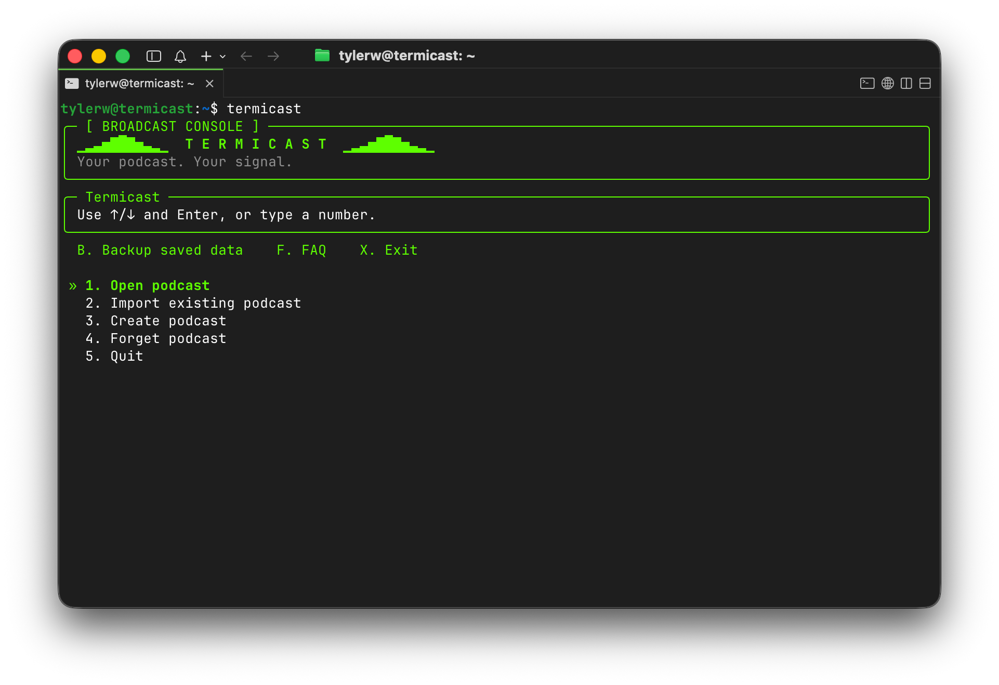

# 📻 Termicast

> [!TIP]
> New here? Start with the **[User Guide](USER_GUIDE.md)** for a plain-English
> walkthrough. This README is the technical reference.

Termicast is a Linux terminal application for managing multiple podcasts and
generating static RSS feeds, chapter files, and prepared media. It uses numbered
menus with arrow-key navigation ([Questionary](https://github.com/tmbo/questionary)),
Rich messages, SQLite state, namespace-aware XML handling, FFmpeg/Pillow media
preparation, and `s4cmd` for S3-compatible deployment.

Termicast combines episode publishing, podcast migration, and media preparation
into one CLI. Add episodes from local media files, schedule them, and deploy
either to a local web server or to S3-compatible object storage.



## 🚀 Quickstart

```sh
sudo apt install python3 python3-venv ffmpeg
python3 -m venv .venv
. .venv/bin/activate
python -m pip install -e '.[dev]'

# Make `termicast` available in any shell (no venv activation needed)
mkdir -p ~/.local/bin
ln -s "$PWD/.venv/bin/termicast" ~/.local/bin/termicast

termicast --help
```

The symlink puts `termicast` on your `PATH` so it works in any shell, script,
or cron entry. `~/.local/bin` must be on `PATH` — most distros add it at login
via `~/.profile`, so log out and back in if `termicast` isn't found right away.
For an interactive-only shortcut instead, add
`alias termicast='/opt/termicast/.venv/bin/termicast'` to `~/.bashrc`. Keep
`.venv` in place; the editable install (`-e`) already picks up code changes
without reinstalling.

Run `termicast` to create or import a podcast. Then add an episode:

```sh
termicast add <show-id> episode.mp3 artwork.jpg transcript.vtt --slug s02ep042
```

Audio is required; artwork and transcript are optional and identified by their
file type. Media files must be on the machine running Termicast.

## 🧭 Commands

```text
termicast                                   interactive menus
termicast add <show-id> FILE...             prepare and publish an episode
termicast deploy <show-id>                  upload saved media assets (S3)
termicast deploy <show-id> --dry-run        no uploads or bucket probes
termicast doctor [show-id]                  read-only hosting/media checks
termicast validate [show-id]                offline feed validation
termicast archive <feed> <dest-dir>         download feed+assets into an archive
termicast restage <manifest> <base-url>     preview URL rewriting + validate
termicast publish-due                       release due scheduled episodes
termicast backup [dest] [--include-media]   private ZIP snapshot
termicast import-csv / export-csv           episode CSV
termicast faq                               read the FAQ without a database
```

`--data-dir` (before any subcommand) overrides the state directory, which
defaults to `~/.local/share/termicast/`.

## 🎙️ Episode workflow

`add` validates inputs (audio required, no ambiguous files), chooses or suggests
an editorial slug, prepares media, shows filenames/settings/sizes, collects
episode details, and publishes now or schedules. The menu **New episode** uses
the same flow.

### 🎚️ Presets

| Audio preset | Output |
| --- | --- |
| **Standard** (default) | MP3, 128 kbps, 44.1 kHz |
| **Music** | MP3, 192 kbps, 44.1 kHz |

| Image preset | Output and target |
| --- | --- |
| **Compact** (default) | JPEG below 500 KB |
| **Detail** | JPEG below 1 MB |

Mono/stereo are preserved; multichannel audio is rejected. Suitable MP3s at or
below the target bitrate are passed through, never uprated. Already-small JPEGs
are preserved; transparency is flattened onto white; oversize square covers are
reduced to 3000x3000. Per-episode overrides: `--audio-preset`, `--image-preset`,
`--keep-audio`, `--keep-image`.

### 🏷️ Slugs and files

`--slug s02ep042` produces:

```text
audio/s02ep042.mp3
images/s02ep042.jpg
transcripts/s02ep042.vtt
chapters/s02ep042.json
```

Extensions follow the actual output format. Slugs use ASCII letters, numbers,
hyphens, and underscores, and must begin with a letter or number. Collisions
with other episodes are rejected before install.

## ⏰ Scheduling and cron

> [!WARNING]
> A scheduled episode stays out of the feed until `publish-due` releases it.
> That command is non-interactive and is meant to run from cron. Without it,
> scheduled episodes never go live.

Run it by hand:

```sh
/opt/termicast/.venv/bin/termicast --data-dir /srv/termicast/state publish-due
```

Add a cron entry (with `crontab -e`, as the account that owns the state and
output directories):

```cron
*/5 * * * * /opt/termicast/.venv/bin/termicast --data-dir /srv/termicast/state publish-due
```

> [!NOTE]
> - Use the **same `--data-dir`** for the interactive app, cron, `validate`,
>   `backup`, and recovery, or they will not see the same schedules.
> - A five-minute interval releases at the **next run**, not the exact
>   scheduled second.
> - Cron does not need venv activation; point it straight at the venv binary.
> - Omit `--data-dir` if state lives in the default `~/.local/share/termicast/`.
> - `publish-due` also retries shows left "dirty" by a previously failed
>   publication, so a transient error self-heals on the next tick.

## ☁️ Hosting

Each show has an output directory and a public HTTPS **base URL**. The feed file
`feed.xml` **always stays on your web server**: it is written to the output
directory and served from `base_url/feed.xml`. Only the media assets (audio,
artwork, transcripts, chapters) can optionally move to object storage.

Hosting is configured under **Hosting** in the show menu:

- **Local web server**: everything — the feed and the media — is served directly
  from the output directory.
- **S3-compatible storage**: the feed stays on your web server (output
  directory + `base_url`), while media assets are uploaded with `s4cmd` to a
  bucket/prefix whose public root is a separate **asset base URL**
  (e.g. `https://my-bucket.us-east-1.linodeobjects.com/my-show`). The feed
  references those asset URLs. Configure credentials outside Termicast in
  `~/.s3cfg`; set the endpoint, bucket, prefix, and asset base URL in Termicast.
  `enabled` controls automatic deployment on publish/schedule; `deploy` works
  with valid configuration even when it is disabled.

> [!IMPORTANT]
> By default, once a media asset is on S3 its local working copy is removed,
> so the output directory holds only `feed.xml` (plus regenerated
> chapter/transcript files during a publish). Set **Keep a local copy**
> (`keep_local_media`) in Hosting to retain the working copies for redundancy
> and media-inclusive backups. Media already on S3 with no local copy is
> skipped on later deploys — remote objects are never deleted automatically.

`feed.xml` is written last, after its media is in place, so the feed never
references a missing file. Deployment uses one `s4cmd` subprocess at a time
(64 MiB single-part threshold, 16 MiB multipart parts, 2 workers), sets explicit
Content-Types, skips unchanged objects via s4cmd's checksum metadata, and never
deletes remote objects automatically.

`doctor` is read-only and checks tools, public feed/media accessibility, MIME
types, and local-versus-remote feed content. `deploy --dry-run` performs no
uploads or bucket probes.

### 🌍 Multiple podcasts on S3

Hosting settings are stored **per show**: `endpoint_url`, `bucket`, `prefix`,
and `asset_base_url` all live on the show record, and `deploy` reads them from
whichever show it is deploying. Several podcasts can therefore publish to
different buckets at the same time. Two shows may also share one bucket under
separate prefixes; overlapping prefixes are rejected when the show is saved.

> [!CAUTION]
> Credentials are the exception. `s4cmd` reads a single `~/.s3cfg` — and only
> its `access_key` and `secret_key` (`host_base` is ignored, since Termicast
> passes the endpoint explicitly per show). Every show therefore deploys with
> the same key pair.

What that allows, and what it does not:

| Setup | Supported |
| --- | --- |
| Several buckets in one account | Yes |
| Several buckets in different regions of one account | Yes — give each show its explicit regional endpoint |
| One bucket shared by several shows under distinct prefixes | Yes |
| Two shows in different **accounts** on one provider | No — would need different keys |
| One show on AWS and another on a different provider | No — would need different keys |

For the multi-region case, set each show's endpoint explicitly (for example
`https://s3.us-west-2.amazonaws.com`) rather than leaving it blank. A blank
endpoint means the AWS region is resolved from ambient configuration
(`AWS_REGION`, `~/.aws/config`), which is shared by every show.

### 🔐 S3 public access and caching

Configure the bucket (or CDN) so objects under the show prefix are publicly
readable, and use the correct Content-Types (see the Hosting → Nginx MIME
snippet in the menu; `nginx_snippet()` / `apache_snippet()` emit equivalents).
For RSS, avoid over-aggressive caching (publishers poll frequently); cache
media and artwork aggressively since their URLs change with new slugs. Note
that egress bandwidth is billed by most object stores; the media presets
reduce size for listeners on slower connections and lower bandwidth costs.
Termicast never sets object ACLs or modifies your web server.

## 📦 Import and migration

Import a feed (HTTPS URL or local XML) or a pre-archived manifest
(`manifest.json` describing feed pages and staged assets). Identity (GUIDs,
chapters, extension data) is preserved.

> [!IMPORTANT]
> After import, run `doctor`, then ask the current host to configure a
> permanent HTTP 301 redirect from the old feed URL to the new `.../feed.xml`.

`termicast archive <feed> <dest-dir>` downloads a feed, its paginated pages
(`atom:link rel="next"`), and referenced assets into a persistent directory with
a `manifest.json`. `termicast restage <manifest> <base-url>` previews the URL
rewriting and validates the result without installing. The archive can be
re-imported later without downloading the catalog again.

## 📈 Podcast metrics (OP3)

Enable **OP3 podcast metrics** under **Edit field** in the settings review to
prefix each episode's enclosure URL with `https://op3.dev/e/` and collect open
download analytics.

> [!NOTE]
> The stored media URL is unchanged; the prefix is applied only when the feed
> is generated. Importing a feed that already uses OP3 (enclosure URLs
> starting with `https://op3.dev/e/`) enables it automatically; turn it off to
> serve unprefixed URLs.

## 💾 Backup and restore

`termicast backup` produces a private (`0600`) ZIP of saved state, feeds, and
chapters; `--include-media` also copies `audio/`, `images/`, and `transcripts/`.

> [!NOTE]
> Restore is manual: stop cron, extract into a private directory, restore the
> database and outputs, regenerate, and verify with `validate` and `doctor`.

## 🗺️ Planned additions

I'm planning optional tools to help prepare podcast episodes:

- **Assisted writing:** Generate editable titles and descriptions using
  Claude, OpenAI, or self-hosted Ollama models, guided by your preferred
  tone, formatting, and writing style.
- **Automatic transcription:** Transcribe audio using OpenAI's cloud API
  or local Python Whisper. An additional OpenAI option will automatically
  detect speaker turns for review and naming.
- **Editable transcripts:** Correct text, timestamps, and speaker names
  within Termicast or through editors such as nano and vim, preserving
  those edits when publishing or regenerating files.

Choose writing and transcription providers independently. A small VPS
could use OpenAI transcription with Claude writing. A home server could
combine local Whisper with Claude, OpenAI, or Ollama models such as
`qwen3.5:4b`. Local Whisper will initially support manual speaker labels.

These features will be optional, with generated content reviewed before
publication. They are planned additions, with no committed release date.

## 🚧 Limits

Media probing and downloads are bounded (2 GiB default, configurable via
`TERMICAST_MAX_MEDIA_BYTES`, `TERMICAST_DOWNLOAD_TIMEOUT`,
`TERMICAST_STALL_TIMEOUT`). Artwork inspection is capped at 20 MiB. Feed XML is
capped at 10 MiB. Validation is offline; use `doctor` for public checks.

---

Developed with the help of machines by **Tyler Woodward** of **The Tyler
Woodward Project**.

[](https://tylerwoodward.me)
[](https://www.threads.net/@tylerwoodward.me)
[](https://www.instagram.com/tylerwoodward.me)
[](https://bsky.app/profile/tylerwoodward.me)
[](https://www.youtube.com/@thetylerwoodwardproject)
[](https://www.facebook.com/thetylerwoodwardproject)
